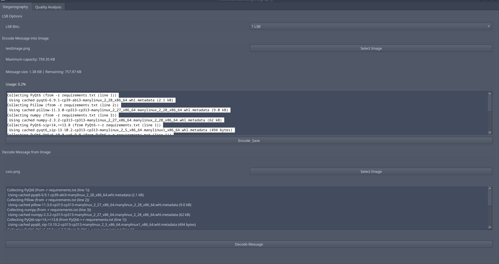
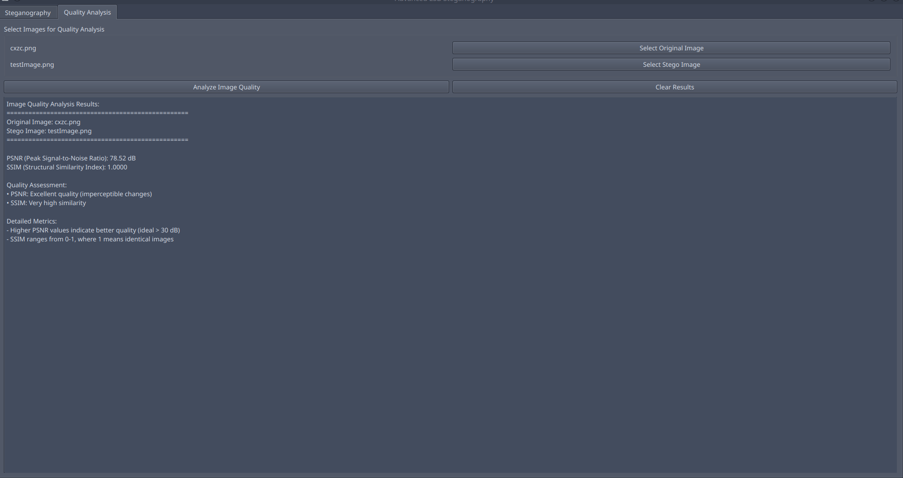

# LSB-Steganography-Toolkit
Easy way to hide secret messages in images. Real-time capacity tracking and quality analysis 
    
## Features



  
### Core Functionality
- **Hide Messages**: Embed confidential text into PNG and BMP images
- **Extract Messages**: Retrieve hidden messages from stego-images
- **Multiple LSB Support**: Choose 1, 2, 3, or 4 LSB bits for encoding
- **Real-time Capacity Monitoring**: See message size and remaining space as you type

### Advanced Features
- **Quality Analysis**: PSNR and SSIM metrics to measure image degradation
- **Dual Image Comparison**: Compare any two images for quality analysis
- **Automatic Unit Conversion**: View capacity in Bytes, KB, MB, or GB
- **Visual Warnings**: Color-coded alerts when approaching capacity limits
- **Progress Tracking**: Visual feedback during encoding operations

## 🚀 Getting Started

### Prerequisites
- Python 3.8 or higher
- PyQt6
- Pillow (PIL)
- NumPy

### Installation

1. **Clone the repository:**
```bash
git clone https://github.com/karmugilen/LSB-Steganography-Toolkit.git
cd LSB-Steganography-Toolkit
```

2. **Install required packages:**
```bash
pip install PyQt6 Pillow numpy
```

3. **Run the application:**
```bash
python main.py
```

## How to Use

### Hiding a Message
1. Go to the "Steganography" tab
2. Click "Select Image" to choose a PNG or BMP image
3. Type your secret message in the text box
4. Watch real-time capacity information:
   - Current message size
   - Remaining space in the image
   - Usage percentage (green/orange/red warnings)
5. Select LSB bits (1-4) for encoding
6. Click "Encode & Save" and choose where to save the stego-image

### Extracting a Message
1. Go to the "Steganography" tab
2. Click "Select Image" to choose a stego-image
3. Select the same number of LSB bits used for encoding
4. Click "Decode Message" to retrieve the hidden text

### Quality Analysis
1. Go to the "Quality Analysis" tab
2. Select an original image and a stego-image
3. Click "Analyze Image Quality" to compare:
   - PSNR (Peak Signal-to-Noise Ratio)
   - SSIM (Structural Similarity Index)
   - Quality assessment and detailed metrics

## Understanding Capacity

As you type your message:
- **Message Size**: Current size of your text
- **Remaining**: Space left in the selected image

## Technical Details

### LSB Bit Options
- **1 LSB**: Maximum security, least capacity
- **2 LSB**: Good balance of security and capacity
- **3 LSB**: Higher capacity, moderate security
- **4 LSB**: Maximum capacity, lower security

### Supported Formats
- **Input Images**: PNG, BMP
- **Output Images**: PNG
- **Text Encoding**: UTF-8

## Important Notes

- **Security Warning**: For high-security applications, consider encrypting your message before embedding
- **Image Quality**: Higher LSB values may cause visible image degradation
- **File Size**: Larger images can hide more data
- **Backup**: Always keep original images when doing steganography experiments

## 🛠 Troubleshooting

### Common Issues
- **"Message too large"**: Choose an image with higher capacity or reduce message size
- **"Failed to encode"**: Ensure the output location is writable
- **"No message found"**: Verify correct LSB setting was used for decoding

### Requirements
If you encounter import errors, ensure all dependencies are installed:
```bash
pip install PyQt6 Pillow numpy
```

## License

This project is licensed under the MIT License - see the LICENSE file for details.

## Acknowledgments

- Built with PyQt6 for the graphical interface
- Uses Pillow for image processing
- Implements standard LSB steganography algorithms

## Contributing

Contributions are welcome! Please feel free to submit pull requests or open issues for bugs and feature requests.

---

**
LSB-Steganography-Toolkit** - Hide in plain sight with professional-grade steganography tools!
